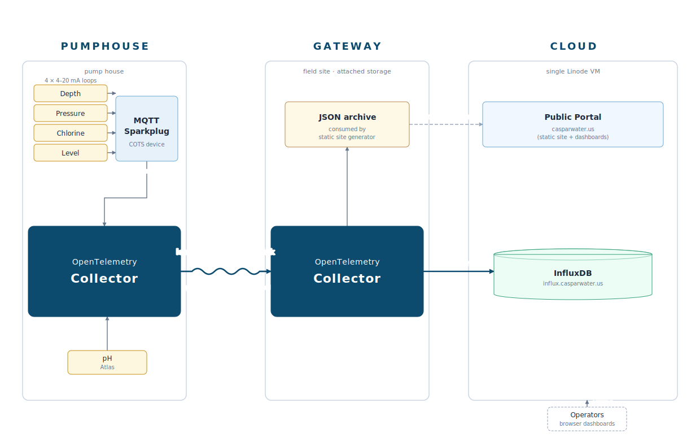

# Caspar Water

System for managing and monitoring a small water system.

## Architecture

  

## Components

### OpenTelemetry Collector
- MQTT Sparkplug-B receiver
- Modbus receiver
- BME280 receiver
- Atlas Scientific EZO pH receiver
- Tiny LCD exporters
- Data recording tools
- Modified InfluxDB exporter

### Water Site (`site/`)
- Public data portal: well depth, tank level, system pressure, chlorine, pH
- Pump cycle analysis with drawdown/recovery charts
- Blog and community information pages
- Generated by [Watertown](https://github.com/jmacd/watertown) sitegen

### Billing
- Custom billing program (`cmd/`)

## Repository Layout

| Directory | Description |
|-----------|-------------|
| `site/` | Caspar Water website: content pages, blog, templates, images, watertown configs |
| `local/` | Local site generation for content/style development |
| `cmd/` | OpenTelemetry collector custom components |
| `collector/` | Compiled collector binary |
| `terraform/station/gateway/` | Gateway provisioning (collector + watertown water/noyo) |
| `terraform/station/cloud/` | Cloud provisioning (cross-pond sitegen + nginx) |
| `terraform/station/staging/` | Pre-release staging on watershop |
| `opentelemetry-mqtt-sparkplug/` | Git submodule providing the MQTT Sparkplug-B receiver |
| `measure/`, `model/`, `storage/`, `display/` | Go packages |

## Operations

| I want to... | Do this |
|---|---|
| Iterate on content/style locally | `cd local && ./setup.sh && ./sync.sh && ./generate.sh && ./serve.sh` |
| Refresh after editing site content | `cd local && ./refresh.sh` |
| Re-sync data from staging | `cd local && ./sync.sh && ./generate.sh` |
| Test full pipeline before prod | `cd terraform/station/staging && ./setup-all.sh && ./run-all.sh` |
| Deploy to gateway | `cd terraform/station/gateway && terraform apply` |
| Deploy to cloud | `cd terraform/station/cloud && terraform apply` |
| Reset one pond on gateway | SSH in, `./watertown/water/teardown.sh && ./watertown/water/setup.sh` |
| Reset site pond on cloud | SSH in, `./watertown/teardown.sh && ./watertown/setup.sh` |
