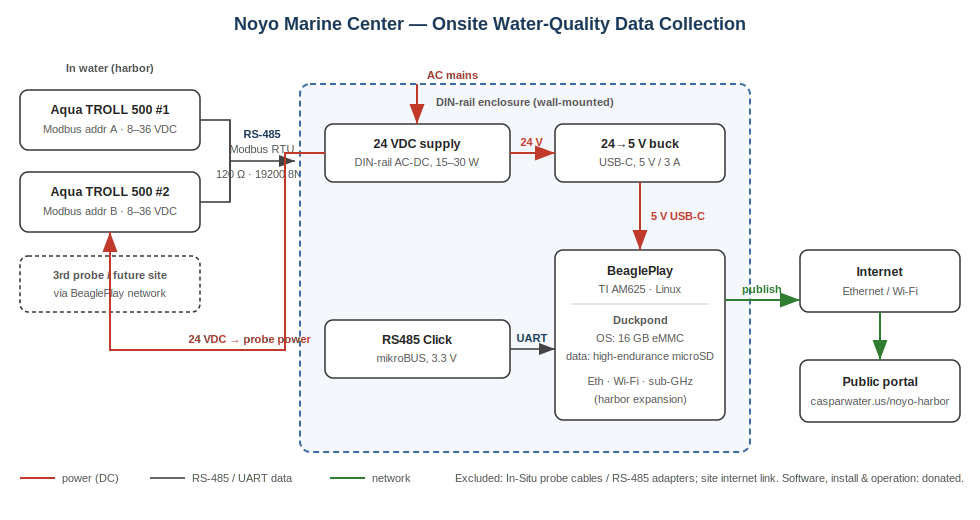

# Proposal: Onsite Water-Quality Data Collection for Noyo Marine Center

> **Prepared for:** Noyo Marine Center — Noyo Harbor water-quality monitoring project
> **Prepared by:** Joshua MacDonald — volunteer; Principal Software Engineer, Microsoft; owner/operator, Caspar Water Company
> **Date:** 2026-06-28
> **Status:** Hardware purchase proposal

## Summary

Noyo Marine Center currently collects water-quality data from two
multi-parameter probes located at its Field Station dock originally
funded through grants to Noyo Ocean Collective.

This proposal requests that Noyo Marine Center purchase computer
equipment to operate the probes directly and to publish its water
quality data to the Noyo Marine Center website using software
supported by Caspar Water Company.

## Background

The water quality probes currently transmit over the cellular
telephone network and public internet to servers operated by the
manufacturer, making them relatively expensive to operate.

The probes measure dissolved oxygen, salinity, water temperature, and
tide level. While three probes were originally purchased for the
study, one was removed from service.

## Engineering

Joshua is a Principal Software Engineer at Microsoft with a specialty
in open-source telemetry systems. He is a founding member of the
OpenTelemetry project, an industry association under the Linux
foundation responsible for software telemetry protocols, where he
a member of the Technical Committee.

Joshua became the owner/operator of Caspar Water Company in 2021, when
he began to create open-source software to manage operations at Caspar
Water Company.

## Open-Source Software

Open-source software is software whose underlying source code is
licensed for public use, allowing anyone to view, modify, share, and
redistribute the original work. After learning about Noyo Harbor Blue
Economy project in 2024, Joshua began developing software to download
data from the manufacturer's website and publish it to a portal.

Today, the software is a complete platform for collecting, archiving
and publishing telemetry data. Watertown is designed to operate at low
cost, with flexible options for off-site storage.

Open-source software is popular with users for avoiding vendor
"lock-in". Because this software is licensed to the public, Noyo
Marine Center will be able to build and operate the software itself if
for any reason Joshua is no longer able to volunteer.

## Detailed design

### Computer

The recommended computer is a [Beagle Play single-board
computer](https://www.beagleboard.org/boards/beagleplay), designed by
the BeagleBoard foundation. It is an open-source hardware design
running the Linux operating system. This model features a number of
wireless connectivity options which could be used to collect from
remote sensors across the harbor in the future.

We will add a 128GB microSD card for local storage.

### Communications

The In-Situ AT500 probes are designed with support for multiple
communication protocols. The simplest and least expensive choice for
Noyo Marine Center is the Modbus protocol using RS-485 communication.

The RS-485 protocol will be added to the computer using a [Mikroe
RS485 Click 3.3V add-on board](https://www.mikroe.com/rs485-33v-click).

### Power

The computer and accessories will be powered through a standard 120V
outlet using two AC:DC power supplies, Mean Well HDR-15-24 for the
probes and HDR-30-5 for the computer.

The system will draw up to 25W of power, approximately 0.6kW daily,
220 kW or approximately $100 yearly to operate.

### Cabling

In-Situ cables are expensive and sold by the foot. Noyo Marine Center
has enough existing cable to reach the dock from a location inside the
Field Station. For two probes to be connected, two cables will be required.

While not necessary, In-Situ sells a [cable splitter
accessory](https://in-situ.com/us/rugged-cable-splitter) that enables
two probes to be connected through one cable run.

## Support

Joshua volunteers to assemble, configure, operate, and monitor the new
hardware for at least 24 months. He will work with Noyo Marine Center
staff to document the system and to deliver backup and publishing
options that meet their needs.

## Bill of materials

Approximate single-unit prices, USD, excluding tax and shipping. Three
small orders: the compute parts, the power supplies, and one
AutomationDirect order that covers the enclosure and all panel wiring.

**Compute** — *[Mouser](https://www.mouser.com/)*

| Part | Part number | Qty | Price |
|------|-------------|----:|------:|
| BeaglePlay single-board computer | BeaglePlay | 1 | $101 |
| Mikroe RS485 Click, 3.3 V | MIKROE-986 | 1 | $22 |
| SanDisk 128GB MAX Endurance microSDXC | SDSQQVR-128G | 1 | $57 |

**Power** — *[Mouser](https://www.mouser.com/)*

| Part | Part number | Qty | Price |
|------|-------------|----:|------:|
| Mean Well 5 V DIN supply (computer) | HDR-30-5 | 1 | $20 |
| Mean Well 24 V DIN supply (probes) | HDR-15-24 | 1 | $20 |

**Enclosure** — *[AutomationDirect](https://www.automationdirect.com)*

| Part | Part number | Qty | Price |
|------|-------------|----:|------:|
| Steel enclosure, NEMA 1 indoor, ~10×8×4 in, screw cover[^enc] | B100804 | 1 | $30 |
| Steel back panel (DIN backing plate) | SPB1008 | 1 | $12 |
| DIN rail, 35 mm steel, 1 m | DN-R35S1 | 1 | $8 |
| DIN-rail end brackets | DN-EB35 | 2 | $2 |
| Feed-through terminal blocks, 12 AWG | DN-T12 | 6 | $6 |
| Ground terminal block | DN-G12 | 2 | $4 |
| Enclosure grounding lug kit (10–14 AWG) | — | 1 | $6 |
| DIN-rail mount for the BeaglePlay (C45 snap clips, M3 standoffs) | — | 1 | $8 |
| Fasteners (M4 screws for rail) | — | 1 | $4 |

**Approximate total: ~$300**

[^enc]: This is an indoor NEMA 1 enclosure that protects the hardware in a
sheltered location. Exterior or wash-down placement would require a weather-rated
enclosure (e.g. a NEMA 4X polycarbonate box), at higher cost.

## Schematic

